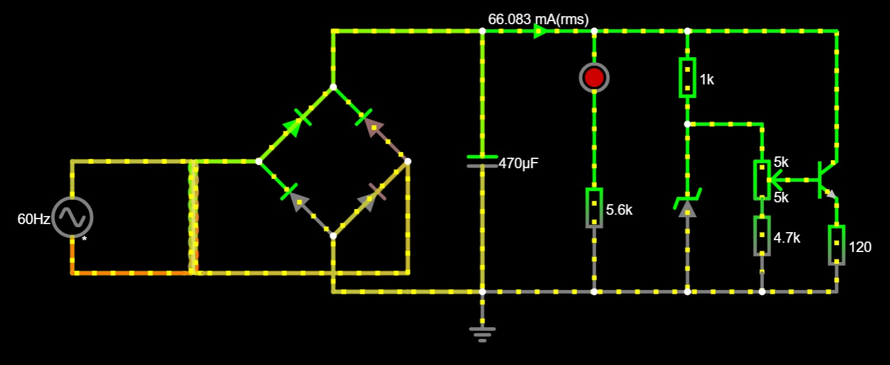

# Fonte-de-Tensao-Ajustavel

## Instruções

Projeto de uma Fonte de Tensão ajustável entre 3V a 12V com capacidade de 100mA. Teremos a partir da tomada: tensão 127 volts, corrente alternada e frequência de 60 hz.

## Componentes Utilizados

| Quantidade | Componentes        | Valor Unit. (R$) |
|------------|--------------------|------------------|
| 4x         | Diodo 1N4007       |      R$ 0,19     |
| 1          | Capacitor 470uF    |      R$ 2,72     |
| 1          | Led Vermelho 5mm   |      R$ 0,49     |
| 1          | Resistor 1k ohm    |      R$ 0,07     |
| 1          | Resistor 120 ohm   |      R$ 0,07     |
| 1          | Resistor 4.7k ohm  |      R$ 0,07     |
| 1          | Resistor 5.6k ohm  |      R$ 0,07     |
| 1          | Potenciómetro 10k  |      R$ 6,79     |
| 1          | Transistor NPN     |      R$ 1,55     |
| 1          | Diodo Zener 13V    |      R$ 0,49     |
| **Total**  |                    |      R$ 28,14    |

A protoboard e o transformador foi adquirida no laboratório com o orientador da disciplina.

## Os Componentes

* **Protoboard:** ...
* **Transformador:** ...
* **Diodo:** ...
* **Capacitor:** ... 
* **Led:** ...
* **Resistor:** ...
* **Potenciómetro:** ...
* **Transistor:** ...
* **Diodo Zener:** ...

## Protoboard

## Cálculo do Capacitor

## Circuito no Falstad (simulador)

Imagem do circuito projetada no simulador Falstad.

[link do Falstad](https://tinyurl.com/22wl3grj)

## Imagem esquemático da PCB

## Imagem PCB no programa Proteus

## Vídeo no Youtube

## Agradecimentos
Agradecemos ao excelentíssimo professor Eduardo do Valle Simões, vulgo Big Simas.

## Alunos

Camila Piscioneri Magalhães [(Dr. Verdin)](https://github.com/Dr-Verdin)
Godoy
Rafael
