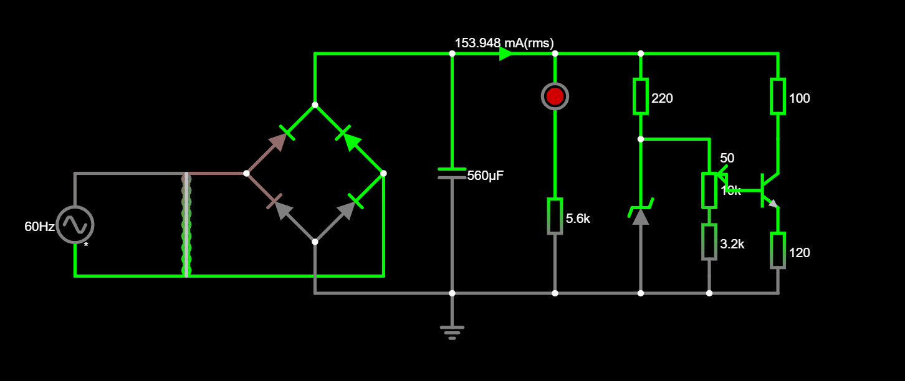

# Fonte-de-Tensao-Ajustavel

## Instruções

Projeto de uma Fonte de Tensão ajustável entre 3V a 12V com capacidade de 100mA. Teremos a partir da tomada: tensão 127 volts, corrente alternada e frequência de 60 hz.

## Componentes Utilizados

| Quantidade | Componentes        | Valor Unit. (R$) |
|------------|--------------------|------------------|
| 4x         | Diodo 1N4007       |      R$ 0,19     |
| 1          | Capacitor 470uF    |      R$ 2,72     |
| 1          | Led Vermelho 5mm   |      R$ 0,49     |
| 1          | Resistor 100Ω      |      R$ 0,07     |
| 1          | Resistor 120Ω      |      R$ 0,07     |
| 1          | Resistor 470Ω      |      R$ 0,07     |
| 1          | Resistor 5.6kΩ     |      R$ 0,07     |
| 1          | Resistor 3.2kΩ     |      R$ 0,07     |
| 1          | Potenciómetro 10k  |      R$ 6,79     |
| 1          | Transistor NPN     |      R$ 1,55     |
| 1          | Diodo Zener 13V    |      R$ 0,49     |
| **Total**  |                    |      R$ 28,14    |

A protoboard e o transformador foi adquirida no laboratório com o orientador da disciplina.

## Os Componentes

* **Protoboard:** é uma placa de plástico com uma série de furos onde você pode inserir componentes eletrônicos para prototipagem e montagem de circuitos temporários. Ela permite que você conecte componentes eletrônicos sem a necessidade de soldagem, facilitando o processo de experimentação e desenvolvimento de projetos eletrônicos. Geralmente, elas são utilizadas para desenvolver e testar circuitos eletrônicos antes de implementá-los em projetos mais complexos.
* **Transformador:** (voltagem AC: 18.1V; voltagem no capacitor; 24.2V)
* **Diodo:** é um componente eletrônico que permite a passagem de corrente elétrica em apenas uma direção enquanto bloqueia o fluxo na direção oposta.
* **Led:** é um Diodo Emissor de Luz, é um componente semicondutor que emite luz visível quando uma corrente elétrica passa por ele.
* **Diodo Zener:** é um tipo especial de diodo projetado para operar na região de ruptura reversa de sua curva característica de tensão-corrente. Os diodos Zener são frequentemente utilizados para fornecer uma referência de tensão estável em circuitos eletrônicos, proteger outros componentes contra picos de tensão e estabilizar circuitos reguladores de alimentação.
* **Capacitor:** têm a capacidade de armazenar carga elétrica temporariamente e liberá-la conforme necessário no circuito.
* **Resistor:** é um componente eletrônico passivo que limita ou controla o fluxo de corrente elétrica em um circuito. Ele é projetado para ter uma resistência específica, medida em ohms (Ω).
* **Potenciómetro:** é um componente eletrônico variável que permite ajustar a resistência elétrica de maneira manual, permitindo controlar a quantidade de corrente que flui através dele.
* **Transistor:** é um componente eletrônico semicondutor que atua como um amplificador de corrente ou um interruptor controlado eletricamente.

## Protoboard

### Vídeo no Youtube
[Link nada suspeito](https://youtu.be/eNDYn4dvQzQ)

## Cálculos
### Razão do Transformador
- Saída de Tensão para o capacitor: 24,2V
- Razão: 7,02

#### Tensão/Teste de Pico

$$ V_{\text{pico}} = V_{\text{entrada}} \times \sqrt{2} $$

Onde:
- V(entrada) é a tensão de entrada da tomada (127V).

$$ V_{\text{pico}} = 179,6V $$
##
#### Saída do Transformador

$$ \frac{1}{7,02} = \frac{V_s}{V_{\text{pico}}} $$

Onde:
- V(pico) é igual à 179.6V

$$ V_s = \frac{179,6V}{7} \approx 25,65V $$

Como cada diodo precisa de uma tensão mínima de 0,7V, devemos subtrair 1,4V da tensão de saída:

$$ V_s = 25,65V - 1,4V = 24,25 $$

### Cálculo da Tensão de Ripple (Vripple)
Consideramos que a tensão de ripple seja 10% da tensão de saída:

$$ V_{\text{ripple}} = 0,1 \times V_s $$

Onde:
- Vs é igual à 24,25V

$$ V_{\text{ripple}} = 0,1 \times 24,25V = 2,42V $$

### Correntes

1. Corrente do LED:

$$ i_{LED} = \frac{V_{máxs} - V_{LED}}{R_{LED}} = \frac{24,05V - 1,7V}{5600 \ \Omega} \approx 3,99 \ mA $$

2. Corrente do diodo zener:

$$ i_{zenner} = \frac{V_{máxs} - V_{zenner}}{R_{zenner}} = \frac{24,05V - 13V}{470 \ \Omega} \approx 23,51 \ mA $$

3. Corrente do potenciômetro:

$$ i_{potenciômetro} = \frac{V_{máxs}}{R_{potenciômetro}} = \frac{24,05V}{13670 \ \Omega} \approx 1,75 \ mA $$

4. Corrente da carga:

$$ i_{carga} = \frac{V_{zenner} - V_{transistor(be)}}{R_{carga}} = \frac{13V - 0,714V}{120 \ \Omega} \approx 102,38 \ mA $$

Somando todas as correntes, obtemos a corrente total:

$$ i_{TOTAL} = 3,99 \ mA + 23,51 \ mA + 1,75 \ mA + 102,38 / mA = 131,63 \ mA $$

### Capacitância

$$ C = \frac{i_{TOTAL}}{f \cdot V_{ripple}} $$

Onde:
- f = 120Hz, pois a frequência de saída é o dobro da frequência de entrada devido à retificação em onda completa na ponte.

$$ C = \frac{131,63 \ mA}{120 \ Hz \cdot 2,42 \ V} \approx 453,27 \ \mu F $$

O valor comercial mais próximo do valor teórico é 470 µF.

## Circuito no Falstad (simulador)

Imagem do circuito projetada no simulador Falstad.

[link do Falstad](https://tinyurl.com/2cn9rnxq)

## Imagem esquemático da PCB

## Imagem PCB no programa Proteus

## Agradecimentos
Agradecemos ao excelentíssimo professor Eduardo do Valle Simões, vulgo Big Simas.

## Alunos
- Camila Piscioneri Magalhães [(Dr. Verdin)](https://github.com/Dr-Verdin).
